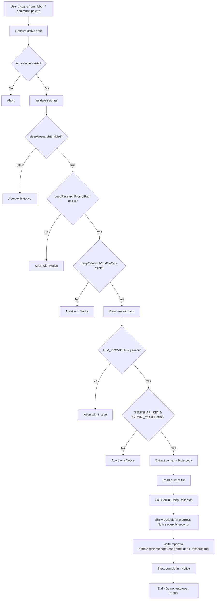

# note-deep-researcher

Simple “Deep Research” runner for Obsidian notes.

This plugin lets you manually run a Gemini-based deep research workflow against the **currently active note** and save the resulting research report into your Vault.

The plugin name is `note-deep-researcher`.

---

## Overview

- **Trigger**
  - Ribbon icon
  - Command palette command: `Run Deep Research on active note`
- **Target**
  - The currently active note (Markdown file)
- **Output**
  - A Markdown report saved under a folder named after the active note

This README describes the intended behavior and user-facing configuration.

Long-running research is handled via Gemini **background execution**. The plugin stores the active `interactionId` so it can resume result collection after Obsidian restarts.

---

## Scope

| In scope | Out of scope |
|---------|------------|
| Manually run research for the active note | |
| Ribbon icon + command palette entry | Coupling to any other plugin/workflow |
| Web sources only (Gemini Deep Research) | Searching across your Vault |
| Save a Markdown report into noteBaseName directory in the Vault | |
| Single active run at a time (simplify UX/implementation) | Managing multiple concurrent runs |

---

## Requirements

- **Obsidian**
  - Desktop app (recommended).
- **Gemini API credentials**
  - Provided via environment variables (see below).
- **Prompt file**
  - A Vault-relative Markdown/text file used as a fixed instruction prompt.

---

## Inputs

- **Deep Research instructions**
  - The content of the file configured by `deepResearchPromptPath` (fixed prompt).
- **Note context**
  - The full body of the active note.

---

## Outputs

- **Directory**: `<noteBaseName>/`
  - `<noteBaseName>`: active note filename without extension
  - If the directory does not exist, the plugin creates it.
- **Report file**: `<noteBaseName>_deep_research.md`
  - Full path: `<noteBaseName>/<noteBaseName>_deep_research.md`
- **Report header template**:
  ```markdown
  # <noteBaseName> deep research report
  ## <timestamp>
  ```
  - `<timestamp>`: ISO 8601 format (e.g., `2025-01-15T10:30:00+09:00`)
- **Overwrite behavior**
  - Re-runs overwrite `<noteBaseName>_deep_research.md`.
- **Prompt scope**
  - Global only (no per-note overrides).

### Run concurrency

- Only **one** Deep Research run can be active at a time.
- If a run is already in progress and the user triggers the command again, the plugin proceeds Reset / Abandon the current run. See below for details.

### Example

If the active note is `my-note.md`, the report is saved to:

`my-note/my-note_deep_research.md`

---

## Settings (`MyPluginSettings`)

| Name | Type | Default | Description |
|--------|---|---------|------|
| `deepResearchEnabled` | boolean | false | Enable/disable this feature |
| `deepResearchPromptPath` | string | - | Vault-relative path to a prompt file used for Deep Research |
| `deepResearchNoticeIntervalSec` | number | 5 | How often to show “in progress” notices (seconds) |
| `deepResearchCheckIntervalSec` | number | 60 | How often to poll `interactions.get()` for the active run (seconds) |
| `deepResearchEnvFilePath` | string | - | Absolute path to an external `.env` file (outside the Vault) |

### Prompt file format (recommended)

The prompt file can be plain text or Markdown. Keep it stable and version-controlled.

Example:

```text
You are a research assistant.

Read the provided note context and produce a deep research report.

Constraints:
- Focus on web sources.
- Provide citations/links.
- Return Markdown.
```

---

## Environment variables (Gemini-only)

The plugin reads credentials from an **external `.env` file** configured via `deepResearchEnvFilePath`.
This file must be outside your Vault (so secrets are not stored in your notes).

### Example `.env`

Create a file outside the Vault, for example:

- Linux: `/home/<user>/.config/note-deep-researcher/.env`
- macOS: `/Users/<user>/.config/note-deep-researcher/.env`
- Windows: `C:\Users\<user>\AppData\Roaming\note-deep-researcher\\.env`

Contents:

```dotenv
LLM_PROVIDER=gemini
GEMINI_API_KEY=...
GEMINI_MODEL=...
```

### Behavior

- If `LLM_PROVIDER != gemini`, the run is blocked (Notice + log).
- If `GEMINI_API_KEY` or `GEMINI_MODEL` is missing, the run is blocked (Notice + log).

### Security

- Never write `GEMINI_API_KEY` to logs.
- Do not store credentials in the Vault.
- Keep the `.env` file readable only by your OS user when possible.

---

## Installation

Once implemented, document the standard Obsidian plugin installation steps here.

For a manual install (developer builds), the typical approach is:

1. Build the plugin bundle.
2. Copy the built output into:
   - `<vault>/.obsidian/plugins/note_deep_researcher/`
3. Enable the plugin in Obsidian settings.

(Exact steps depend on your build tooling; document them once the code exists.)

---

## How to use

1. Open the note you want to research.
2. Trigger the plugin:
   - Click the ribbon icon, or
   - Run the command: `Run Deep Research on active note`
3. Wait until the plugin completes.
4. The report will be created/updated under `<noteBaseName>/<noteBaseName>_deep_research.md`.

### Reset / Abandon

- This plugin does **not** guarantee Gemini-side job cancellation.
- Instead, it provides a single **Reset / Abandon** action that clears the locally stored pending run (so you can start a new one).

#### How users invoke Reset / Abandon

- **Command palette**
  - `Deep Research: Reset / Abandon current run`
- **Ribbon icon while running**
  - If a run is already in progress and the user clicks the ribbon icon, show a confirmation UI:
    - Message: `Deep Research is running for <note name>. Abandon it?`
    - Buttons: `Abandon` / `Keep running`
  - If the user selects `Abandon`, clear the local pending state and show a Notice.

---

## Processing flow



---

## Logging / reasons

Each run should emit a single “result” log entry with a `reason` code. Keep logs **non-sensitive**.

**Log destination**: `<vault>/.obsidian/plugins/note-deep-researcher/note-deep-researcher.log`

| reason | 説明 |
|--------|-----|
| `DR_DISABLED` | Aborted because feature is disabled |
| `DR_NO_ACTIVE_NOTE` | No active note |
| `DR_PROMPT_PATH_MISSING` | `deepResearchPromptPath` not set |
| `DR_ENV_PATH_MISSING` | `deepResearchEnvFilePath` not set |
| `DR_PROMPT_READ_FAILED` | Failed to read prompt file |
| `DR_ENV_READ_FAILED` | Failed to read environment variables |
| `DR_PROVIDER_NOT_GEMINI` | `LLM_PROVIDER!=gemini` |
| `DR_GEMINI_KEY_MISSING` | Missing `GEMINI_API_KEY` |
| `DR_GEMINI_MODEL_MISSING` | Missing `GEMINI_MODEL` |
| `DR_REQUEST_FAILED` | Gemini request failed |
| `DR_WRITE_FAILED` | Failed to write report |
| `DR_OK` | Success |

---

## Error handling expectations

- The plugin should fail fast on configuration/credential issues.
- Network/API failures should produce a clear Notice and a single non-sensitive log entry.
- If writing the report fails, do not partially overwrite the existing file; write to a temporary path then replace.

---

## Implementation notes

### Provider interface

Define a provider interface to keep the orchestration testable:

- `DeepResearchProvider.run(params) -> markdownReport`

### Gemini implementation

Implement `GeminiDeepResearchProvider` to call the Gemini API.

Important constraints:

- Do not log prompts, note contents, or API responses verbatim unless explicitly enabled for debugging.
- Consider rate limits, latency, and potential costs.
- Prefer a local **Reset / Abandon** command over “cancel,” since Gemini-side cancellation may not be available.

### Orchestration

Create `src/deep_research.ts` to:

- validate inputs/settings
- assemble context
- call provider
- write output

---

## Development checklist

1. Add settings: `deepResearchEnabled`, `deepResearchPromptPath`, `deepResearchNoticeIntervalSec`
2. Add ribbon icon via `addRibbonIcon`
3. Add command: `Run Deep Research on active note`
4. Implement `DeepResearchProvider`
5. Implement `GeminiDeepResearchProvider`
6. Implement orchestration in `src/deep_research_simple.ts`
7. Integrate with existing logger + Notice patterns
8. Manual QA for each `reason` case

---

## Privacy & security

- This feature sends (parts of) your note content to an external LLM provider (Gemini).
- Avoid running on notes that contain secrets.
- Make it explicit in UI/README that note content may be transmitted to Gemini.
- Ensure logs never include:
  - API keys
  - full note contents
  - full model responses

---

## Acceptance criteria

- Can run Deep Research on the active note via ribbon/command.
- If Gemini credentials are missing, abort with Notice + log.
- On success, create/update the Markdown report and show a completion Notice.
- Logs must not contain sensitive information.

